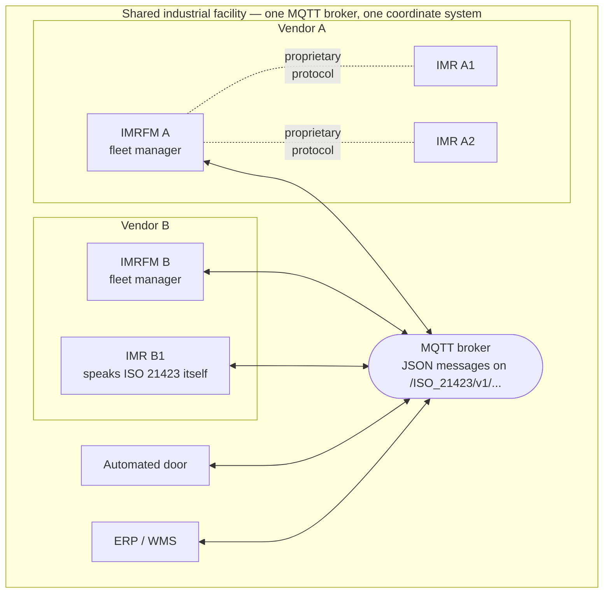
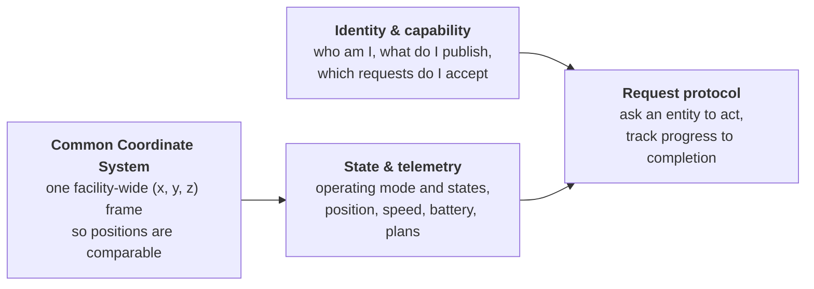

# 01 — Overview: what ISO 21423 does

## The problem

Picture a distribution center. Vendor A supplies pallet-moving robots with their own fleet manager. Vendor B supplies tote-carrying robots with theirs. The building has automated doors, a freight lift, and an alarm system. Today, each of these is an island:

- Fleet A's traffic manager cannot see fleet B's robots — they meet in aisles by surprise.
- Neither fleet knows the door is closed until a robot is parked in front of it.
- The warehouse management system needs a custom integration per vendor to know where anything is.

ISO 21423 gives all of these participants **one common way to share information and request actions**, without requiring anyone to abandon their internal protocols. A vendor's robots can keep speaking their proprietary language to their own fleet manager; the fleet manager then *represents* them on the shared channel.

## The big picture

Key things this diagram shows:

1. **Everything meets at an MQTT broker.** There is no point-to-point wiring; participants publish and subscribe to well-known topics.
2. **A fleet manager can front for its robots.** Vendor A's robots never speak ISO 21423 — their IMRFM publishes their positions and accepts commands on their behalf. This *managed entity* pattern is a first-class feature (see [Participants](02-participants.md)).
3. **Robots can also participate directly.** Vendor B's robot B1 publishes its own data.
4. **Non-robot equipment joins the same network.** Doors, lifts, alarms, and business systems use the same message patterns (see [Extending](07-extending.md)).

## The four pillars

ISO 21423 is best understood as four cooperating specifications:

- **Common Coordinate System (CCS)** — every location in every message is expressed in one shared facility frame, in meters. Each vendor calibrates its own maps to that frame using at least three surveyed reference points. → [Chapter 03](03-common-coordinate-system.md)
- **Identity & capability** — on startup (and on change) every entity publishes who it is, what data it provides, and what requests it accepts. Because identity messages are *retained* by the broker, anyone can discover the whole population by subscribing to one wildcard topic. → [Chapters 04](04-communication.md) & [05](05-entity-data.md)
- **State & telemetry** — entities continuously publish operating states (`CHARGING`, `BLOCKED`, `MODE_AUTO`, ...), odometry (pose + velocity), battery status, and optionally their short-term trajectory and longer-term plans. → [Chapter 05](05-entity-data.md)
- **Request protocol** — any participant can send a `request` containing a list of actions (`move`, `dock`, `pauseImr`, ...) to any entity that accepts them, and receives `requestStatus` updates as the request moves through a defined state machine until it ends in `SUCCEEDED`, `CANCELED`, or `ABORTED`. → [Chapter 06](06-requests.md)

## What the standard is *not*

Understanding the boundaries prevents the most common misconceptions:

| Not in ISO 21423 | Who handles it instead |
|---|---|
| Safety functions, emergency stops as safety measures | Machine safety standards (e.g. IEC 60204-1 defines the *stop categories* whose names appear in status messages — but reporting a state is not a safety function) |
| Navigation, path planning, obstacle avoidance | The robot vendor's software |
| Task/order optimization, "which robot should do this job" | Fleet managers (the standard only lets you *address* a fleet manager and let it pick a robot) |
| Broker deployment, authentication, permissions | The site deployment (the standard recommends following IEC 62443 / ISO/IEC 27001; see [Chapter 07](07-extending.md)) |
| Payment for use of shared infrastructure, business rules | Out of scope entirely |

**Intended environments:** industrial workplaces — manufacturing, warehousing, logistics, labs — where the public is not expected to be present. Explicitly excluded: entertainment, consumer, military, medical applications, and public roads.

## A five-minute mental model

> Every participant is an **entity** with a UUID. Entities announce themselves on a
> shared MQTT broker with a retained **identity** message, keep a retained **status**
> up to date, and stream **odometry** while moving. All coordinates are in the
> facility's **common coordinate system**. When one entity wants another to do
> something, it publishes a **request** to the target's request topic and watches
> **requestStatus** messages until the request reaches a terminal state. Robots that
> don't speak the protocol are represented by their **fleet manager**, which
> publishes and receives on their behalf.

Everything else in this documentation is detail on top of that paragraph.

---

*Next: [02 — Participants](02-participants.md)*
