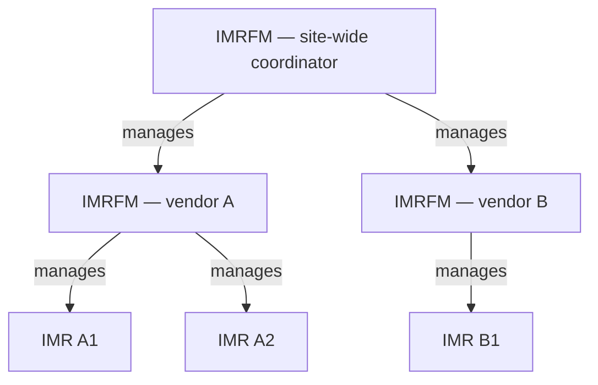
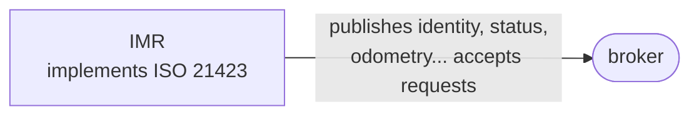
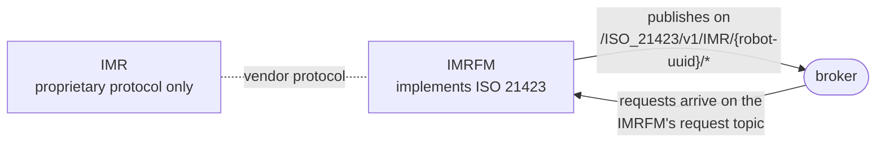
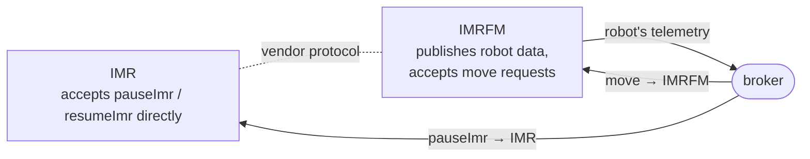

# 02 — Participants: entities, robots, and fleet managers

## Entities

In ISO 21423 every participant on the network is an **entity**: a sender or receiver of the standard's JSON messages, identified by a UUID. The standard defines two entity types and explicitly allows more:

| Entity type | What it is |
|---|---|
| **IMR** — *industrial mobile robot* | A mobile platform (plus any integrated attachments) that navigates an industrial environment. Autonomous or guided. |
| **IMRFM** — *industrial mobile robot fleet manager* | Software that monitors and directs one or more fleets of IMRs: traffic management, order management, charging, parking, coordination. |
| *(extensions)* | Deployments may add types such as `DOOR` or `LIFT` using the same patterns — see [Chapter 07](07-extending.md). |

Every entity owns a topic namespace derived from its type and UUID (`/ISO_21423/v1/IMR/<uuid>/...`), publishes an **identity**, keeps a **status**, and may accept **requests**. What exactly it provides and accepts is declared in its **capabilities**.

## Capabilities: the entity's self-description

Each identity message carries a `capabilities` object — the contract the entity offers to the network:

```json
{
  "provides": ["identity", "status", "batteryStatus", "odometry", "activeRequestsStatus"],
  "accepts": { "requests": ["pauseImr", "resumeImr", "move", "dock", "undock"] },
  "manages": ["aa53a1e1-782f-479b-88b3-fd110198be45"],
  "managedBy": "fe84b20f-f9fa-4b92-844c-b69effb98d83"
}
```

- **`provides`** — which resources (topics) this entity publishes. Names match topic names.
- **`accepts.requests`** — which request action types it will execute (see [Chapter 06](06-requests.md)).
- **`manages` / `managedBy`** — the fleet hierarchy, explained next.

## The management hierarchy

The single most important design idea in ISO 21423 is that **an entity's data can be published by someone else**. A robot that has never heard of ISO 21423 can still appear on the network, because its fleet manager publishes under the robot's namespace and accepts requests on its behalf.

`manages` and `managedBy` make the relationships explicit and can form multi-level trees:



A managing entity is responsible for publishing **all** data of its managed entities — including each managed entity's identity — under each managed entity's own topic namespace. To the rest of the network, a fully-managed robot looks exactly like a robot that publishes for itself; only the `managedBy` field reveals the arrangement.

## Three participation patterns

The standard names three supported configurations for how an IMR participates:

### Pattern 1 — The robot speaks for itself



The IMR implements the standard, publishes its own state, and (capabilities permitting) accepts request messages directly.

### Pattern 2 — The fleet manager fronts entirely for the robot



The robot publishes nothing itself; its capabilities read `"provides": []` and `"accepts": {"requests": []}` with a `managedBy` pointing at the fleet manager. The IMRFM publishes the robot's identity, status, and telemetry under the *robot's* namespace, and executes requests for it (received on the *IMRFM's* request topic).

This is the standard's bridge for legacy and proprietary fleets — and the reason multi-vendor sites can adopt ISO 21423 without waiting for every robot firmware to change.

### Pattern 3 — Hybrid: shared responsibilities



The robot accepts *some* requests itself (say, `pauseImr`/`resumeImr` for immediate local response) while the fleet manager publishes its data and remains the only entity that can `move` it. Both declare their share in their capabilities, so a sender always knows whom to address.

> One combination is *not* supported: an IMRFM that publishes nothing. Fleet managers, by definition, implement the standard.

## Fleet manager as translator

A useful way to think about Pattern 2: the IMRFM is a **protocol translator**. The standard's own sequence diagrams show a requester talking ISO 21423 to a vendor's fleet manager, which converts each request into the vendor's proprietary robot commands and converts robot progress back into `requestStatus` updates. Any number of such translators can coexist on one broker — that *is* the interoperability story.

## What each participant type publishes

| | IMR | IMRFM |
|---|---|---|
| identity & capabilities | ✔ (Table: model, serial, footprint, working area, height, software versions, rated speed/load, ...) | ✔ (model, software versions, support contact, ...) |
| status (operating states) | ✔ — mode + active states, e.g. `["MODE_AUTO", "CHARGING"]` | ✔ — one of `READY`, `NOT_READY`, `OFFLINE` |
| odometry / battery / trajectory / plans | ✔ where capable | — (publishes *its robots'*, not its own) |
| accepts requests | optional, per capabilities | ✔ expected (it is the door to its fleet) |

Details of each message are in [Chapter 05 — Entity data](05-entity-data.md).

---

*Next: [03 — The Common Coordinate System](03-common-coordinate-system.md)*
