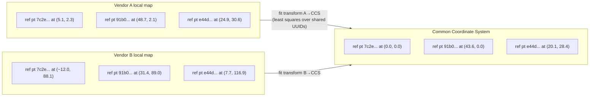

# 03 — The Common Coordinate System (CCS)

## Why it exists

Every robot vendor builds its own maps, with its own origin and orientation. If vendor A says "robot at (12.4, 7.1)" and vendor B says "robot at (203.7, −44.2)", those numbers are useless to each other — they refer to different origins. Sharing positions is meaningless until everyone agrees on **one coordinate frame**.

ISO 21423's answer is the **Common Coordinate System**: a single facility-wide Euclidean frame that all location data in all messages is expressed in.

## The rules

- One CCS per physical space (floor, mezzanine, building). All fleets operating in the same space **must** use the same one.
- The **CCS origin point** is an arbitrarily chosen fixed point in the facility — a corner of a column, a mark on the floor — designated (0, 0, 0).
- Coordinates are in **meters**, and the frame follows the **right-hand rule**.
- The `z` coordinate is relative to the ground plane; negative means below it.
- Locations that live on ramps or elevated areas are projected onto the horizontal plane for reference-point purposes.

## Reference points: how everyone calibrates

Agreeing on an origin is not enough — each vendor needs a way to *align its own map* to the CCS. The standard requires at least **three reference points** per CCS:

- each has a **UUID** and a surveyed (x, y) position in the CCS;
- each corresponds to something identifiable in every vendor's local map (fiducial markers, room corners — anything both surveyable and mappable);
- they should be **spread out** across the operating area, because widely-spaced points minimize the effect of measurement error on the fitted transform;
- every vendor's map must contain matching points using the **same UUIDs** — the UUID is what ties "this corner in my map" to "this surveyed point in the facility".

With ≥3 shared points, each fleet manager computes the transformation between its local map frame and the CCS (a rotation + translation, fitted by least squares — the standard's Annex D walks through the math with worked examples).



Once fitted, transforms work in both directions: a fleet manager converts its robots' poses *to* the CCS before publishing, and converts other fleets' published positions *back* into its own map frame for traffic decisions.

## The data objects

Three small objects carry all of this in messages:

**CCS** — declares a coordinate system:

```json
{
  "id": "2385eed2-86ca-4dc9-8f17-dac062ce9a08",
  "name": "Building 4, floor 1",
  "referencePointIds": ["7c2e...", "91b0...", "e44d..."]
}
```

**Reference point** — a surveyed calibration point:

```json
{ "id": "7c2e...", "name": "NW column base", "x": 0.0, "y": 0.0 }
```

**Location point** — where something is, in a given CCS, at a moment in time. This is the object embedded in odometry, trajectories, move targets, and everywhere else a position appears:

```json
{ "ccsId": "2385eed2-86ca-4dc9-8f17-dac062ce9a08", "x": 33.0, "y": 3.0, "z": 0.0 }
```

Note the `ccsId`: every location says *which* CCS it is expressed in, which keeps multi-floor and multi-building deployments unambiguous.

## Robot-local geometry: origin, footprint, working area

Positions alone don't capture how much *space* a robot occupies. Three robot-local concepts complete the picture (all defined relative to the robot, not the facility):

- **IMR origin point** — the point inside the robot designated as its local (0, 0, 0); usually chosen by the manufacturer. The robot's published location point is the position of this origin in the CCS.
- **IMR footprint** — a 2D polygon (list of points in meters, clockwise, implicitly closed) around the robot's physical outline *including payload*, relative to the IMR origin. It can change at runtime — a robot carrying an oversized pallet reports a bigger footprint.
- **IMR working area** — a larger polygon around the footprint representing the space the robot needs to work and maneuver.

```
        y ▲
          │      ┌───────────────────┐  ← working area
          │      │   ┌───────────┐   │
          │      │   │ footprint │   │
          │      │   │     ●     │───│──→ x
          │      │   │  origin   │   │
          │      │   └───────────┘   │
          │      └───────────────────┘
```

A traffic manager combines *location point* (where the origin is, in CCS) with *footprint/working area* (how much space around it is occupied) to know what floor space is actually taken.

> **Practical note:** the standard defines the CCS data objects and the calibration
> procedure, but leaves *how* reference-point data is distributed to each deployment —
> typically site configuration shared with every fleet at commissioning time.

---

*Next: [04 — Communication layer](04-communication.md)*
