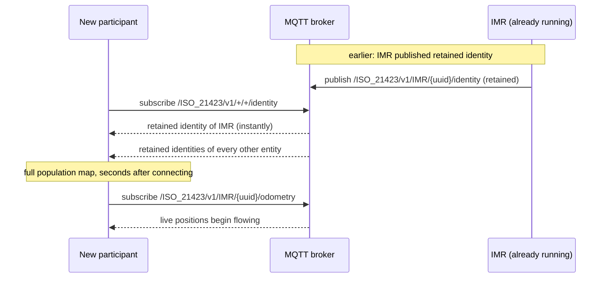

# 04 — Communication layer: MQTT topics, discovery, and sessions

## Transport choices

ISO 21423 standardizes two layers most protocols leave open:

- **Transport:** MQTT v3.1.1 (ISO/IEC 20922) — the ubiquitous publish/subscribe protocol of the IoT world. One broker per deployment; no peer-to-peer connections.
- **Encoding:** JSON (ISO/IEC 21778), validated by a normative JSON Schema shipped in the standard's Annex A.

MQTT was a natural fit because its **retained messages** give late joiners instant state, its **wildcard subscriptions** give discovery for free, and its **Last Will** mechanism gives crash detection — the standard leans on all three, as you'll see below.

## Topic layout

Every topic follows one structure:

```
/ISO_21423/v1/<entityType>/<entityUuid>/<resourceName>

  └── root ──┘ └── who ─────────────┘ └── what ─────┘
```

Examples:

```
/ISO_21423/v1/IMR/91403a21-7534-4467-99a6-79c46a130fe8/identity
/ISO_21423/v1/IMR/91403a21-7534-4467-99a6-79c46a130fe8/odometry
/ISO_21423/v1/IMRFM/3ddd8e04-1606-4ac8-8174-8321ee094278/status
/ISO_21423/v1/IMR/91403a21-.../request/aa53a1e1-...            ← request to this robot
/ISO_21423/v1/IMR/91403a21-.../request/aa53a1e1-.../status     ← that request's progress
```

Two subtleties:

- The `v1` is the **major version** of the standard. All minor versions within a major version interoperate and share the same schema, so the topic only carries the major. (Entities state their full `[major].[minor]` version in their identity.)
- The resources under an entity's namespace always *describe that entity* — but may be *published by another entity* (the managing fleet manager — see [Chapter 02](02-participants.md)).

## Resources

The standard's resource catalog, with the delivery guarantees each one gets:

| Resource | QoS | Pattern | Content |
|---|---|---|---|
| `identity` | 1 | retained, on change | Who the entity is + capabilities ([Ch. 05](05-entity-data.md)) |
| `status` | 1 | retained, on change | Operating mode and active states |
| `batteryStatus` | 0 | retained, on change | State of charge, health, charging state |
| `odometry` | 0 | streaming 0.5–30 Hz | Pose (location + orientation) and velocity |
| `localTrajectory` | 0 | streaming 1–10 Hz | Near-term path with timestamps |
| `globalPath` | 1 | retained, on change | Planned geometric path (NURBS curve) |
| `globalPlan` | 1 | retained, on change | Future destinations with ETAs |
| `footprint` | 1 | retained, on change | Active footprint (it can change with payload) |
| `request/<requestUuid>` | 2 | retained | A request addressed to this entity ([Ch. 06](06-requests.md)) |
| `request/<requestUuid>/status` | 2 | retained | Progress of that request |
| `activeRequestsStatus` | 1 | retained | Snapshot of all requests this entity is executing |

How to read the patterns:

- **Retained** resources are the entity's "current value": the broker stores the last message and hands it to any new subscriber immediately. They are republished **only when the content changes** — status updates are never periodic heartbeats.
- **Streaming** resources are fast-moving telemetry published at a set rate within the given bounds. They are not retained; you get them while you listen. QoS 0 is deliberate: for 10 Hz odometry, the next sample is better than a redelivered old one.
- **Requests** use QoS 2 (exactly-once) — commands must be neither lost nor duplicated.

Deployments may add resource names of their own; the listed ones are the interoperable core.

## Discovery: one subscription to see everything

Because `identity` is retained, discovery requires no directory service and no announcements protocol:

```
subscribe  /ISO_21423/v1/+/+/identity
```

The broker immediately delivers the retained identity of **every entity that has ever announced itself**, then keeps delivering new/changed identities as they occur.



From each identity, the subscriber learns the entity's capabilities — which further topics exist and which requests it accepts — and can subscribe selectively from there.

## Sessions and the Last Will: knowing who's really online

Retained state has a dark side: a crashed robot's retained `status` still says everything is fine. The standard closes this gap with mandatory MQTT session rules:

- **Persistent sessions** — every entity connects with a persistent session, so QoS 1/2 messages published while it was briefly offline are delivered when it returns.
- **Keep-alive of 60 s** — the entity must ping at least once a minute, giving the broker a bounded detection window.
- **Last Will and Testament (LWT)** — at connect time, every entity registers a will with the broker:
  - topic: `/ISO_21423/v1/<entityType>/<entityUuid>/disconnection`
  - payload: `"states": ["LOST_CONNECTION"]`
  - QoS 1, **retained**

If the entity's connection dies without a clean disconnect — crash, cable pull, Wi-Fi dropout — the **broker itself** publishes the will. Anyone subscribed to the entity's `disconnection` topic learns of the loss within the keep-alive window, and because the will is retained, even late joiners see that this entity is gone.

```mermaid
sequenceDiagram
    participant IMR as IMR
    participant BROKER as Broker
    participant FM as Traffic manager

    IMR->>BROKER: CONNECT (persistent, keepalive 60 s,<br/>will = disconnection topic, retained)
    FM->>BROKER: subscribe .../IMR/{uuid}/disconnection

    Note over IMR: Wi-Fi dies — no DISCONNECT sent
    Note over BROKER: keep-alive expires
    BROKER-->>FM: publish will: states: ["LOST_CONNECTION"] (retained)
    Note over FM: robot treated as offline;<br/>traffic plans around its last known position
```

## Quality-of-service cheat sheet

For readers new to MQTT, the three QoS levels the tables refer to:

| QoS | Guarantee | Used for |
|---|---|---|
| 0 — at most once | May be lost; never duplicated | High-rate telemetry (odometry, trajectories) |
| 1 — at least once | Delivered, possibly duplicated | State that's safe to re-apply (identity, status) |
| 2 — exactly once | Delivered exactly once, highest overhead | Requests and their status — commands must not double-execute |

---

*Next: [05 — Entity data](05-entity-data.md)*
