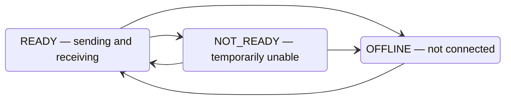
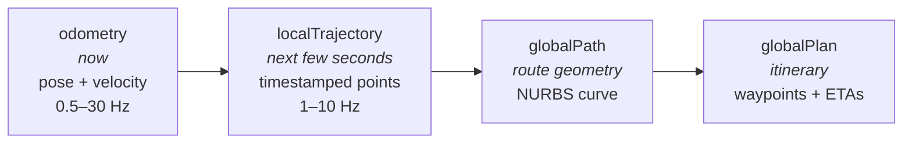

# 05 — Entity data: identity, states, and telemetry

This chapter covers what entities *say about themselves*: the identity card they present on arrival, the operating states they keep current, and the telemetry they stream while working.

## Identity: the entity's business card

Published on startup and whenever it changes (retained, so always available to new subscribers). An IMR's identity, trimmed to the essentials:

```json
{
  "timestamp": "2025-04-08T12:34:56.789Z",
  "id": "91403a21-7534-4467-99a6-79c46a130fe8",
  "entityType": "IMR",
  "manufacturerName": "Example Robotics GmbH",
  "iso21423Version": "1.0",
  "capabilities": {
    "provides": ["identity", "status", "batteryStatus", "odometry",
                 "localTrajectory", "globalPath", "globalPlan", "activeRequestsStatus"],
    "accepts": { "requests": ["pauseImr", "resumeImr", "move", "dock", "undock"] }
  },
  "details": {
    "imrModel": "TUG-500",
    "imrSerialNumber": "TS-2025-0042",
    "imrFootprint": [ { "x": 8, "y": 0 }, { "x": 6, "y": -4 }, { "x": -2, "y": -4 },
                      { "x": -2, "y": 4 }, { "x": 6, "y": 4 } ],
    "imrWorkingArea": [ { "x": 9, "y": -5 }, { "x": -3, "y": -5 },
                        { "x": -3, "y": 5 }, { "x": 9, "y": 5 } ],
    "imrHeight": 1.9,
    "softwareVersions": [ { "moduleName": "navigation", "moduleVersion": "4.2.1" } ],
    "ratedSpeed": 1.8,
    "ratedLoad": 500.0,
    "supportedChargerTypes": ["CCS-24V-A"]
  }
}
```

What's worth noticing:

- **`capabilities` is the machine-readable contract** — which topics to expect and which requests will be honored ([Chapter 02](02-participants.md)).
- **`details` is the spec sheet**: physical footprint and working area polygons (in meters, relative to the robot's own origin — [Chapter 03](03-common-coordinate-system.md)), maximum height, software versions, rated speed and load, charger compatibility, plus optional support links, thumbnail image, battery and payload types, and free-form key/value `additionalProperties` for anything vendor-specific.
- If a robot cannot *detect* changes to footprint, working area, height, speed or payload, it must report the **maximum** values — conservative numbers keep traffic management safe.
- Fleet managers publish an analogous identity with IMRFM-shaped `details` (model, software versions, support contact).

## Status: operating mode and operating states

The `status` message is a compact list of strings — but with structure:

```json
{
  "entityId": "d41e4efe-65e5-4070-8c0d-578c07f05ab4",
  "timestamp": "2025-04-08T12:34:56.789Z",
  "states": ["DOCKING", "LOW_BATTERY", "MODE_AUTO"]
}
```

The rules of the list:

1. **Exactly one operating *mode*** is always present — one of:

   | Mode | Meaning |
   |---|---|
   | `MODE_AUTO` | Fully autonomous |
   | `MODE_SEMIAUTO` | Semi-autonomous / assisted manual |
   | `MODE_TELEOP` | Remote operator drives |
   | `MODE_MANUAL` | Manual |
   | `MODE_MAINTENANCE` | Under maintenance |

2. **Zero or more operating *states*** describe what's currently true, ordered by the robot's own priority: the mode first, then the highest-priority state. A selection of the vocabulary:

   | State | Meaning |
   |---|---|
   | `STOP_CATEGORY_0/1/2` | A stop is in effect (categories per IEC 60204-1: 0 = power cut, 1 = controlled stop then power cut, 2 = controlled stop, power retained) |
   | `LOST` | Lost localization — the robot doesn't know where it is |
   | `BLOCKED` | Cannot make progress (includes deadlocks) |
   | `PAUSED` | Temporarily paused, objective retained |
   | `DOCKING` | Docking with a station, charger, or another robot |
   | `CHARGING` | Charging and cannot move |
   | `LOW_BATTERY` | Battery low |
   | `IDLE` | No current order/mission/task |
   | `PARKED` | Parked |
   | `WAIT_FOR_RESET` / `WAIT_FOR_EVENT` / `WAIT_FOR_ATTACHMENT` | Waiting on a human, an external event, or an attachment |
   | `SLOWING` / `ACCELERATING` / `LEFT_TURN` / `RIGHT_TURN` / `FORWARD` / `REVERSE` | Motion hints, useful for people and traffic prediction |
   | `MAPPING` / `LINE_FOLLOWING` / `ATTACHMENT_ACTIVE` / `STOPPED` / `OFFLINE` | Self-explanatory |

   Which of these *must* be reported depends on the mode: in `MODE_AUTO`/`MODE_SEMIAUTO`, states like `LOST`, `DOCKING`, `CHARGING`, `IDLE`, `PARKED` and the stop categories are required when active; many others are recommended or optional. In manual/teleop/maintenance modes, the stop categories must still be communicated when present.

3. **The vocabulary is extensible** — deployments may define new uppercase state strings, but only for purposes not already covered by the standard list.

Status is published **when it changes**, not on a timer ([Chapter 04](04-communication.md)).

Fleet managers have a much simpler state model:



## Telemetry: where the robot is and where it's going

Four messages describe motion, at three time horizons — *now*, *the next few seconds*, and *the plan*:



**`odometry`** — the workhorse. Position in the CCS, orientation, and speeds, streamed while moving:

```json
{
  "timestamp": "2025-04-08T12:34:56.789Z",
  "pose": {
    "locationPoint": { "ccsId": "2385eed2-...", "x": 33.0, "y": 3.0, "z": 0.0 },
    "orientation": { "yaw": 1.0, "pitch": 0.0, "roll": 0.0 }
  },
  "velocity": { "linear": 1.2, "angular": 0.0 }
}
```

**`localTrajectory`** — the path the robot will follow within its sensor range: an ordered list of location points, each with the time the robot expects to be there. This is what lets another fleet's traffic manager predict a crossing conflict seconds before it happens.

**`globalPath`** — the geometric shape of the planned route beyond sensor range, encoded as a NURBS curve (degree, control points with optional weights, knot vector) — a compact way to publish smooth curves of any length.

**`globalPlan`** — the itinerary: a short list of significant future stops (intersections, work locations) with estimated arrival times. Deliberately coarse — it is not a high-resolution extension of the trajectory.

**`batteryStatus`** — rounds out the picture:

```json
{
  "timestamp": "2025-04-08T12:34:56.789Z",
  "batterySoc": 0.95,
  "batteryHealth": "HEALTHY",
  "batteryChargingState": "DISCHARGING",
  "batteryTemperature": 23.0,
  "batteryVoltage": 12.0,
  "batteryCurrent": 2.3
}
```

`batterySoc` is a fraction (1.0 = 100 %). Health values: `UNKNOWN`, `HEALTHY`, `OVERHEAT`, `DEAD`, `OVERVOLTAGE`, `FAILURE`, `COLD`; charging states: `UNKNOWN`, `CHARGING`, `DISCHARGING`, `NOT_CHARGING`, `FULL`.

## Timestamps everywhere

Every message carries an ISO 8601 timestamp (`2025-04-08T12:34:56.789Z`, UTC, millisecond precision). Consumers should always reason from message timestamps rather than arrival times — MQTT delivery adds jitter, and retained messages may be arbitrarily old.

---

*Next: [06 — The request protocol](06-requests.md)*
