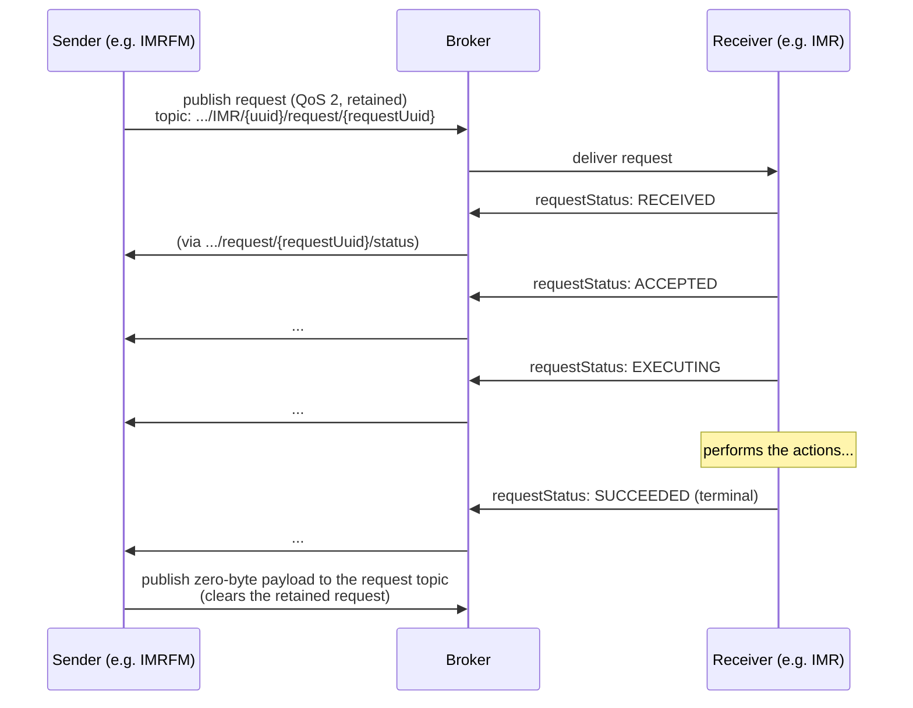
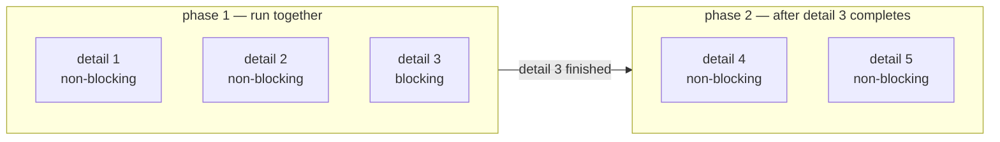
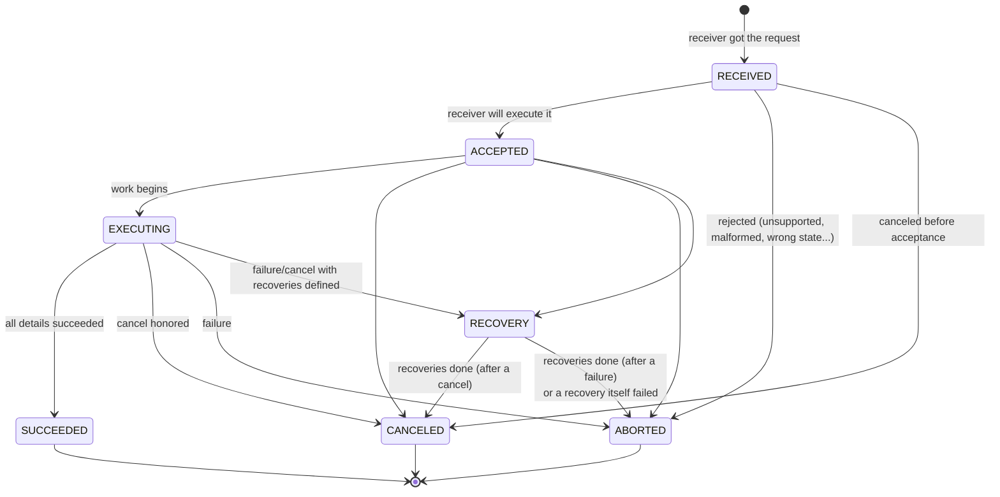
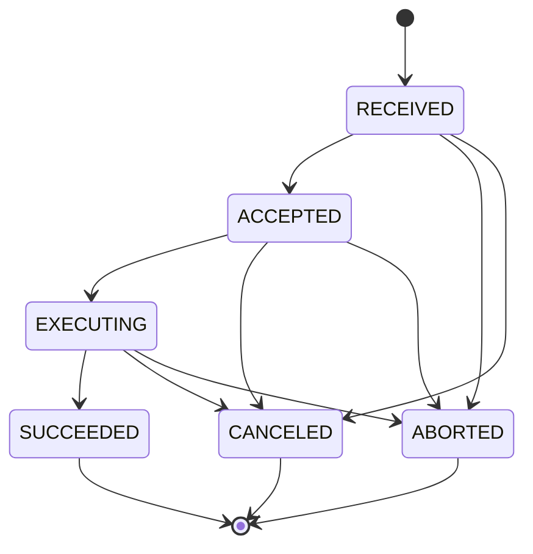
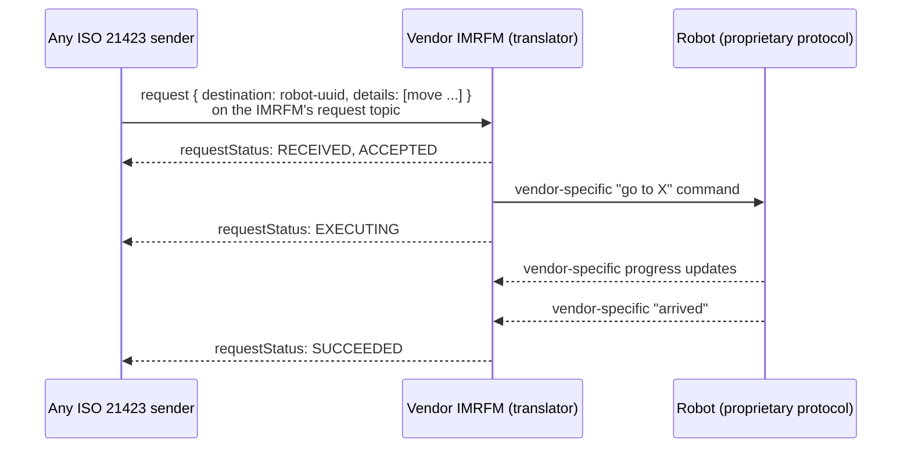
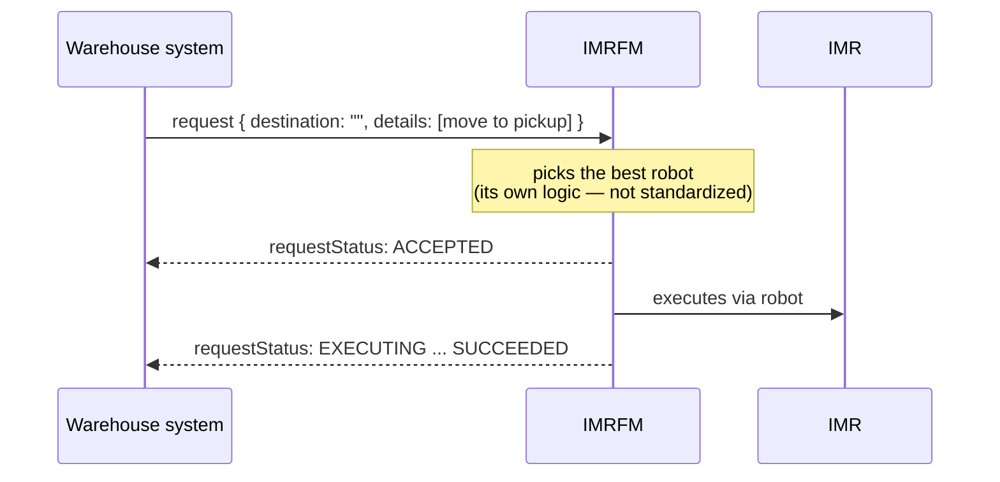

# 06 — The request protocol: asking entities to act

Everything so far has been *observation* — entities describing themselves. The request protocol is where ISO 21423 becomes *interactive*: any participant can ask another to perform actions and follow the work to completion.

## The cast

- **Sender** — the entity issuing the request (often a fleet manager or a facility system, but any entity may send).
- **Receiver** — the entity addressed by the request (an IMR, an IMRFM acting for its robots, a door...).
- **Request** — an envelope containing an ordered list of **actions** (called *request details*), plus optional **recovery actions** to run if things go wrong.
- **Request status** — the receiver's progress reports, sent **only when the state changes** — never periodically.

## The basic conversation



Mechanics worth knowing:

- Each request gets its own **UUID in the topic name**, so many senders can address the same receiver concurrently without collision, and each request's status has its own topic.
- Requests are **retained with QoS 2** (exactly-once): a receiver that reconnects still finds pending requests waiting; commands are never duplicated.
- When a request reaches a terminal state, the retained message is **cleared** by publishing a zero-byte payload to the same topic — the "inbox" doesn't accumulate finished work.
- The receiver also maintains an aggregated **`activeRequestsStatus`** topic (retained) listing the status of everything it is currently executing — one subscription shows a robot's whole workload.

## The request envelope

```json
{
  "source":      "5f4d2824-d279-4fdf-9050-62e0cef72f25",
  "destination": "42177726-26f7-4f5c-b735-a12a427bb96d",
  "sequenceId":  42,
  "timestamp":   "2025-04-08T12:34:56.789Z",
  "priority":    100,
  "atomic":      false,
  "details":     [ /* ordered list of actions — see below */ ],
  "recoveries":  [ /* actions to run if a detail fails or is canceled */ ]
}
```

| Field | Role |
|---|---|
| `source` / `destination` | Sender's and intended executor's UUIDs. `source` + `sequenceId` uniquely identify the request. |
| `destination` left empty | Special case: when sent to a fleet manager, an empty destination means **"you pick the robot"** — the IMRFM selects an IMR (or forwards to another IMRFM). This is how "someone, come pick this up" is expressed. |
| `priority` | Relative urgency: 0 = highest, 100 = normal (default), 255 = lowest. |
| `atomic` | If true, the whole request must run to completion and cannot be interrupted. |
| `details` | The actions, in order. |
| `recoveries` | A contingency script: if any detail ends `CANCELED` or `ABORTED`, the receiver runs these (e.g. "move out of the way so others can use the charger"). |

## Actions (request details)

Each entry in `details` has the same shape — a typed action with common control flags and type-specific properties:

```json
{
  "type": "move",
  "version": "1.0",
  "format": "ISO-21423",
  "blocking": true,
  "atomic": false,
  "properties": {
    "location": { "ccsId": "2385eed2-...", "x": 33.0, "y": 3.0, "z": 0.0 },
    "toleranceRadius": 0.25
  }
}
```

- **`blocking`** (default `true`) — the executor must finish this detail before starting the next. Consecutive *non-blocking* details may run in parallel.
- **`atomic`** (default `false`) — once started, this detail cannot be interrupted.
- **`format`** — defaults to `ISO-21423`; vendors may define their own formats and action types, making the mechanism extensible.

### The standard actions

Any entity that reports its location must be able to handle the first four; docking robots should support the last two.

| Action | Meaning | Key properties |
|---|---|---|
| `move` | Travel to a destination (point-to-point — the *path* is the robot's business) | `location`; optional `toleranceRadius` (arrival circle), `orientationTolerance` (yaw/pitch/roll ranges), `arrivalTime` |
| `pauseImr` | Pause all activity, keep the objective; adds `PAUSED` to the operating states | — |
| `resumeImr` | Resume everything previously active; drops `PAUSED` | — |
| `cancel` | Cancel a previously sent request (or one action in it) | `source` + `requestId` identifying the target request; optional `actionId` |
| `dock` | Dock at a station and optionally perform station actions | `dockLocation`; optional `dockId`, `dockActions` (`CHARGE`, `DUMP`, `FILL`, `LOAD`, `UNLOAD`, `PICK`, `DROP`), tolerances |
| `undock` | Leave the dock | — |

### Blocking and parallelism, illustrated

A request with five details — details 1, 2, 4, 5 non-blocking, detail 3 blocking:



The executor may start 1, 2 and 3 together (1 and 2 don't require waiting); but because 3 is blocking, 4 and 5 must wait for **3** to finish.

## The state machines

### Request lifecycle

Every request moves through this state machine, reported via `requestStatus` on each change:



*(Reconstructed from the standard's state tables and text; the official state
diagrams are Figures C.3 and C.4 of the standard.)*

The three **terminal states** tell the sender how things ended:

- `SUCCEEDED` — every detail completed successfully.
- `CANCELED` — the request was canceled (by a `cancel` action).
- `ABORTED` — the executor terminated it; typically a failure. The status carries a machine-readable `reason`.

`RECOVERY` is the interesting one: when a request *would* end in `CANCELED`/`ABORTED` and the sender supplied `recoveries`, the receiver first executes the recovery actions (reporting `RECOVERY`), then lands on the terminal state. If a recovery action itself fails, the request is `ABORTED`. All detail and recovery statuses are preserved in the final report, so the sender sees the complete history.

### Per-detail lifecycle

Each action inside the request has its own, simpler state machine (no `RECOVERY` — recoveries exist at request level):



A `requestStatus` message therefore contains the overall state **plus** a `detailStatuses` array mirroring every detail with its own `status.code`, an optional `reason`, and an optional human-readable `message`:

```json
{
  "source": "42177726-...", "destination": "5f4d2824-...",
  "sequenceId": 7, "requestSequenceId": 42,
  "timestamp": "2025-04-08T12:35:10.100Z",
  "status": "EXECUTING",
  "detailStatuses": [
    { "type": "move", "version": "1.0", "status": { "code": "SUCCEEDED", "reason": "OK" } },
    { "type": "dock", "version": "1.0", "status": { "code": "EXECUTING" } }
  ]
}
```

Standard `reason` codes (vendors may add more): `OK`, `GENERAL_FAILURE`, `TIMEOUT`, `VERSION_NOT_SUPPORTED`, `FORMAT_NOT_SUPPORTED`, `ACTION_NOT_IMPLEMENTED`, `REJECTED`, `MALFORMED_REQUEST`, `INVALID_IMR_STATE_FOR_ACTION`.

## A complete example: "go charge, and don't block the charger"

The standard's flagship example. The sender asks a robot to move to a charger, then charge to 80 % — and, should anything fail along the way, to move out of the way so the charger stays usable:

```json
{
  "source": "5f4d2824-d279-4fdf-9050-62e0cef72f25",
  "destination": "42177726-26f7-4f5c-b735-a12a427bb96d",
  "sequenceId": 42,
  "timestamp": "2025-04-08T12:34:56.789Z",
  "details": [
    { "type": "move",   "version": "1.0", "blocking": true,
      "properties": { "location": { "ccsId": "2385eed2-...", "x": 33.0, "y": 3.0, "z": 0 } } },
    { "type": "charge", "version": "1.0", "blocking": true,
      "properties": { "targetSoc": 0.8 } }
  ],
  "recoveries": [
    { "type": "move",   "version": "1.0", "blocking": true,
      "properties": { "location": { "ccsId": "2385eed2-...", "x": 30.0, "y": 8.0, "z": 0 } } }
  ]
}
```

(`charge` here is a vendor/deployment-defined action type — the mechanism is designed for such extensions; the standard's own `dock` with `dockActions: ["CHARGE"]` covers the common case.)

## Routing patterns

### Direct: sender → robot

When the robot accepts requests itself, the sender publishes straight to the robot's request topic. Simple, shown in the first sequence diagram above.

### Via a translating fleet manager

When the robot speaks only a proprietary protocol, its vendor's fleet manager translates:



The sender never knows or cares that translation happened.

### Fleet-level dispatch (empty destination)



## Concurrent requests

What if a robot already executing a request receives another? The standard deliberately leaves the policy to the implementation, but enumerates acceptable strategies:

1. **Abort the new request** — "busy, try later".
2. **Accept and buffer it, canceling the active request first** — newest wins; further arrivals replace the buffered one.
3. **Accept and buffer it, executing after the current one completes** — queue of one.
4. **Execute in parallel** — up to an implementation-defined limit.
5. **Execute in priority order** — using the `priority` field.

Senders should watch the request status rather than assume a policy — a robot mid-move with a non-cancellable request may not even be able to `pauseImr`.

---

*Next: [07 — Extending the standard](07-extending.md)*
