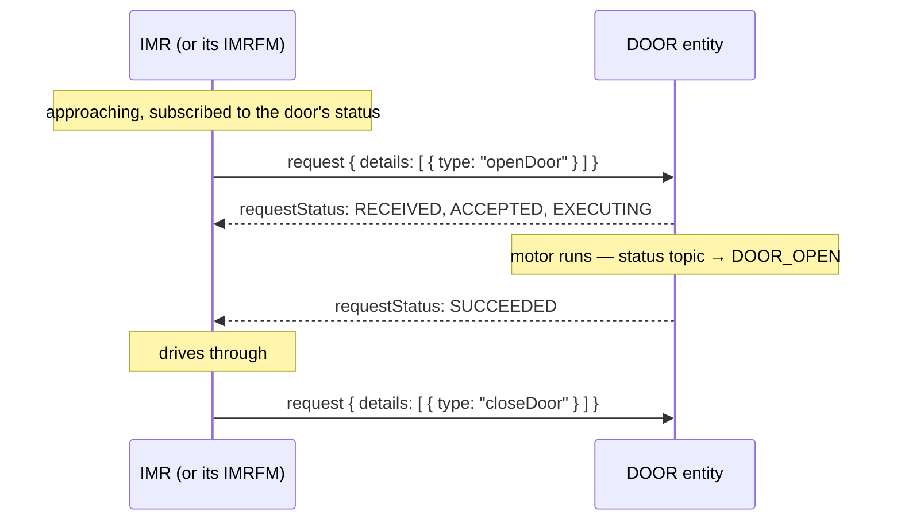

# 07 — Extending the standard: doors, lifts, and security notes

## Designed-in extension points

ISO 21423 anticipates that real deployments need more than robots and fleet managers. Four dimensions are explicitly open:

| Extension point | How |
|---|---|
| **Entity types** | Add new types beyond `IMR`/`IMRFM` (e.g. `DOOR`, `LIFT`) — same topic layout, same message patterns |
| **Resources** | Deployments may add topic/resource names beyond the standard catalog |
| **Operating states** | New uppercase state strings, for purposes not already covered by the standard vocabulary |
| **Request actions** | New action `type`s (and even alternative `format`s) in request details |

The mechanism is always the same: the *pattern* is standardized, the *vocabulary* grows.

## Worked example: an automated door

The standard's own informative example (Annex B.7) integrates automated doors — worth walking through because it shows how little is needed.

**1. Pick an agreed entity type.** The deployment chooses `DOOR`. The door (or the building system fronting for it — the managed-entity pattern works here too) gets a UUID and a namespace:

```
/ISO_21423/v1/DOOR/97413d2a-9024-413a-82ce-d754708f918d/...
```

**2. Publish an identity** — same shape as any entity, with door-appropriate capabilities:

```json
{
  "timestamp": "2025-04-08T12:34:56.789Z",
  "id": "97413d2a-9024-413a-82ce-d754708f918d",
  "entityType": "DOOR",
  "manufacturerName": "Doors Inc",
  "capabilities": {
    "provides": ["identity", "status", "activeRequestsStatus"],
    "accepts": { "requests": ["openDoor", "closeDoor"] }
  },
  "details": { "location": { "ccsId": "2385eed2-...", "x": 21.0, "y": 14.5, "z": 0.0 } }
}
```

**3. Publish status** with deployment-defined states:

```json
{
  "entityId": "97413d2a-9024-413a-82ce-d754708f918d",
  "timestamp": "2025-04-08T12:40:00.000Z",
  "states": ["DOOR_CLOSED"]
}
```

**4. Accept requests** using the standard request protocol with custom action types (`openDoor`, `closeDoor`). A robot approaching the door sends:



That's the entire integration: discovery, status, and requests — all reused. Lifts, alarm systems, charging stations, and ERP endpoints follow the same recipe.

## Versioning: how the protocol evolves

- The topic namespace carries only the **major** version (`/ISO_21423/v1/`). Everything sharing a major version interoperates and uses the same JSON schema.
- **Minor** versions must not introduce breaking changes — a v1.5 fleet manager can talk to a v1.1 robot.
- Each entity declares its full `[major].[minor]` in its identity (`iso21423Version`), and each request detail carries its own `version`, so receivers can reject actions from an unsupported version with the `VERSION_NOT_SUPPORTED` reason rather than misbehave.

## Security: what the standard says (and doesn't)

The standard's security requirement is a single recommendation: follow cyber-security and authentication best practices per **IEC 62443** or **ISO/IEC 27001**. It deliberately does not standardize an auth mechanism — that's a deployment concern. In practice, a deployment secures an ISO 21423 network with standard MQTT tooling:

- **Authentication** — TLS on the broker connection, plus either username/password in the MQTT CONNECT or mutual TLS with client certificates.
- **Authorization** — broker-side ACLs over topic patterns. The topic layout makes this natural, since every topic embeds the owning entity's UUID:

| Participant | Typical grants |
|---|---|
| An IMR | write on its own namespace `/ISO_21423/v1/IMR/<own-uuid>/#`; read as needed |
| An IMRFM | write on its own namespace **plus** each managed robot's namespace (it publishes on their behalf) |
| A request sender | write on the target's `request/+` topics; read on `request/+/status` |
| A dashboard | read-only on `/ISO_21423/v1/#` |

- **Least privilege matters** here more than in single-vendor systems: on a multi-vendor broker, ACLs are what stop one vendor's software from impersonating another vendor's robots.

> **Caveat for implementers:** MQTT 3.1.1 has no way to tell a client its *publish*
> was denied — unauthorized publishes are silently dropped. Denied *subscriptions* are
> visible. Verify ACL configurations actively (e.g. subscribe to your own topic and
> check the echo) rather than assuming success.

---

*Next: [08 — Glossary](08-glossary.md)*
